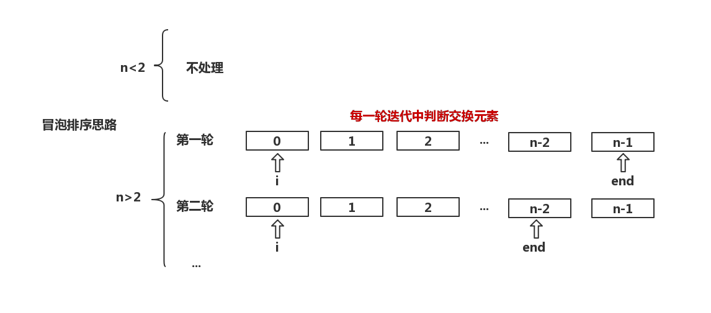

## 冒泡排序
冒泡排序是一种交换排序，基本思想是：两两比较记录之间的关键字，如果是反序，一趟比较下来，有一个元素一定是已经排序好的元素

最简单的排序应该是使用当前位置的记录，与后续未排序的序列的记录进行比较，每次比较中，如果是反序，则交换两个的记录，从而使得当前位置是有序的。

冒泡排序则在每次的迭代中，都有可能将元素放到更接近最后排序的位置

## 冒泡排序的优化
有时候，当确定了一个位置是有序后，其实序列已经是有序的，但是仍然不知道序列已经有序，所以可以设置一个`flag`用于判断序列是否有序，**如果在比较过程中没有发生交换，就是有序的**。

## 思路图
