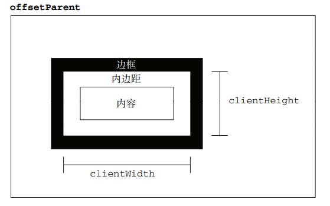

## 客户区大小(client dimension)
元素的客户区大小（client dimension），指的是元素内容及其内边距所占据的空间大小。客户区大小就是元素内部的空间大小，因此滚动条占用的空间不计算在内。



客户区大小的属性有两个：clientWidth 和 clientHeight：
1. Element.clientWidth:只读属性,表示元素的内部宽度，等于content宽度加上左右padding宽度，不包括垂直滚动条（如果有）、边框和外边距
2. Element.clientHeight: 只读属性，表示元素的内部高度，等于content宽度加上左右padding宽度，不包括水平滚动条高度（如果有）、边框和外边距
```js
// intElemClientWidth 返回值会四舍五入为一个整数 

let intElemClientWidth = element.clientWidth

// intElemClientHeight 返回值会四舍五入为一个整数 
let intElemClientHeight = element.clientHeight;
```
> 该属性值会被四舍五入为一个整数。如果你需要一个小数值，可使用 element.getBoundingClientRect()。

## 边框大小
1. Element.clientTop：只读属性，表示元素顶部边框的宽度。总是与`getComputedStyle() 中的border-top-width`整数部分相同
4. Element.clientLeft：表示一个元素的左边框的宽度。如果元素的文本方向是从右向左（RTL, right-to-left），并且由于内容溢出导致左边出现了一个垂直滚动条，则该属性包括滚动条的宽度

```js
// top 返回值会四舍五入为一个整数,相当于Math.round(parseFloat())
let top = Element.clientTop

// top 返回值会四舍五入为一个整数,相当于Math.round(parseFloat())
let left = Element.clientLeft
```

## 滚动位置
1. Element.scrollLeft 属性获取或设置元素内容从其左边缘滚动的像素数, 也可以理解为滚动后，隐藏的内容宽度大小
2. Element.scrollTop 属性获取或设置元素内容从其上边缘滚动的像素数，也可以理解为滚动后，隐藏的内容高度大小

```js
// sLeft 返回值会四舍五入为一个整数
sLeft = element.scrollLeft

// sTop
sTop = element.scrollTop
```
scrollLeft 可以设置为任意整数，但是
1. 如果元素不能滚动（比如：元素没有溢出），那么scrollLeft 的值是0
2. 如果给scrollLeft 设置的值小于0，那么scrollLeft 的值将变为0
3. 如果给scrollLeft 设置的值大于元素内容最大宽度，那么scrollLeft 的值将被设为元素最大宽度

## 滚动大小
滚动大小（scroll dimension），指的是包含滚动内容的元素的大小。包括：

1. scrollWidth：只读属性，是元素内容宽度的度量，其中包括由于溢出而在屏幕上不可见的内容
2. scrollHeight：只读属性，是元素内容高度的度量，其中包括由于溢出而在屏幕上不可见的内容

```js
// 如果元素滚动到底，下面等式返回true，没有则返回false.
element.scrollHeight - element.scrollTop === element.clientHeight
```


