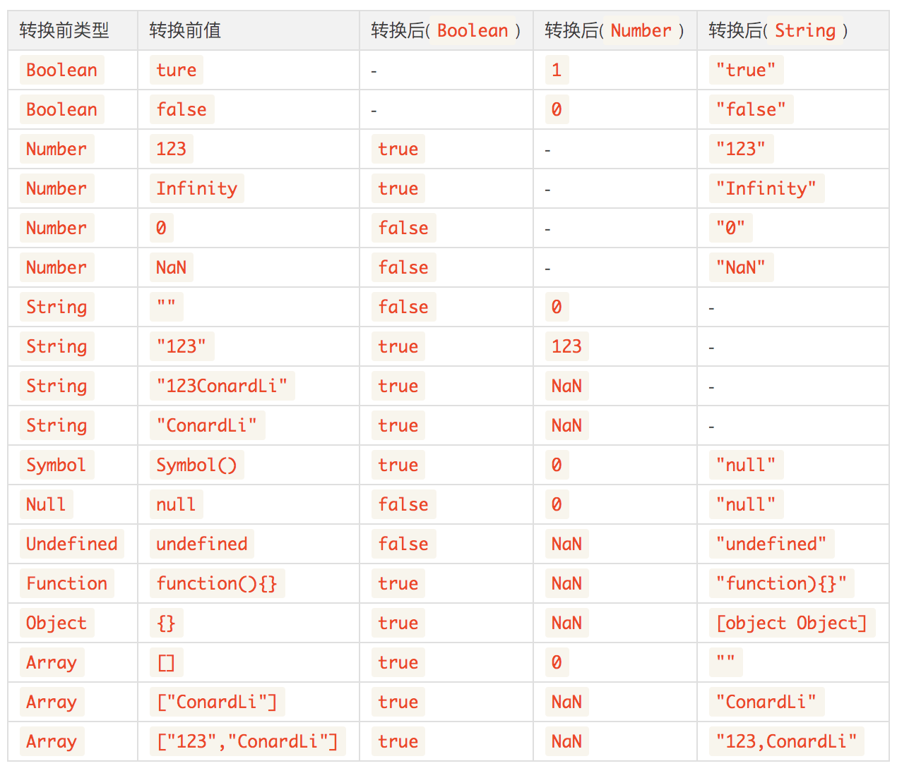

## 隐式转换规则图


隐式转换一般发生在逻辑判断，关系判断，相等判断，四则运算等情况下

##  if语句和逻辑语句
如果只有单个变量，会先将变量转换为Boolean值
1. 假值
- fasle
- 0 -0 NaN
- ''
- null
- undefined

2. 真值。假值列表之外的值

## 数学运算符
* 非Number类型运用数学运算符(- * /)时，会先将非Number类型转换为Number类型
* +是个例外，执行+操作符时：
   1. 当一侧为String类型，被识别为字符串拼接，并会优先将另一侧转换为字符串类型。
   2. 当一侧为Number类型，另一侧为原始类型，则将原始类型转换为Number类型。
   3. 当一侧为Number类型，另一侧为引用类型，将引用类型和Number类型转换成字符串后拼接。

   ```js
   123 + '123' // 123123   （规则1）
   123 + null  // 123    （规则2）
   123 + true // 124    （规则2）
   123 + {}  // 123[object Object]    （规则3）
   ```


## ==
两侧类型不一致时会发生类型转换
1. NaN和其他任何类型比较永远返回false(包括和他自己)
2. Boolean和其他任何类型比较，Boolean首先被转换为Number类型
  > 虽然undefined、null和false都很容易被想象成假值，但是他们比较结果是false，原因是false首先被转换成0：
3. String和Number比较，先将String转换为Number类型
4. null == undefined比较结果是true，除此之外，null、undefined和其他任何结果的比较值都为false
5. 原始类型和引用类型
  - 原始类型和引用类型做比较时，对象类型会依照ToPrimitive规则转换为原始类型
  ```js
  '[object Object]' == {} // true
  '1,2,3' == [1, 2, 3] // true

  // !的优先级高于==，![]首先会被转换为false
  // 然后根据上面第二点false转换成Number类型0
  // 左侧[]转换为0，两侧比较相等
  [] == ![] // true
  ```


  == 规则
1. 对象与对象比较，比较内存地址
2. null 和 undefined 对比为true。与其他对比为fasle
3. 非null 和 非 undefined，ToPrimitive抽象操作。比较类型相同，直接比较
4. 比较类型不同，两边都进行 ToNumber 抽象操作。然后进行比较

## 比较运算符转换规则
1. 先对两边进行ToPrimitive 抽象操作
2. 结果出现非字符串，那么将两边进行 ToNumber 抽象操作
3. 两边都是字符串类型，则按照字母顺序进行比较

