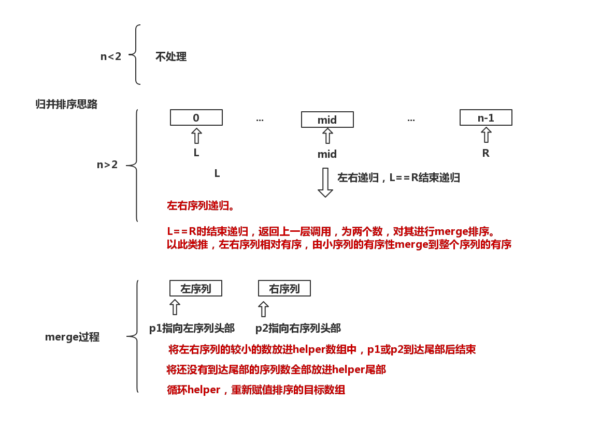

### 代码
```js
/* 
归并排序时间复杂度需要用到master公式求解，可以先看递归部分

思路：
1. 左右排好序
2. 左右对比，外排到一个数组内
*/

function mergeSort(arr) {
  if (arr.length < 2) return;

  // 调用排序函数
  sortPoresss(arr, 0, arr.length - 1);
}

// L是左边界，R是又边界
function sortPoresss(arr, L, R) {
  if (L == R) return;

  let mid = Math.floor((L + R) / 2);
  // 左排序
  sortPoresss(arr, L, mid);
  // 右排序
  sortPoresss(arr, mid + 1, R);

  // 合并，整理好排序
  merge(arr, L, mid, R);
}

function merge(arr, L, mid, R) {
  // 新建一个排序辅助数组
  let help = [];

  // 两个指针分别指向左右两个有序数组开端
  let p1 = L;
  let p2 = mid + 1;

  let i = 0; // 辅助数组的长度
  while (p1 <= mid && p2 <= R) {
    help[i++] = arr[p1] < arr[p2] ? arr[p1++] : arr[p2++];
  }

  // 左右两个数组，哪一个到达终点，就把另外一个剩余元素推到辅助数组中
  while (p1 <= mid) {
    help[i++] = arr[p1++];
  }

  while (p2 <= R) {
    help[i++] = arr[p2++];
  }

  // 将arr数组从L到i的位置开始修改i
  for (let i = 0; i < help.length; i++) {
    arr[L + i] = help[i];
  }
}

let arr = [3, 9, 8, 7, 1];
mergeSort(arr);
console.log(arr);
```